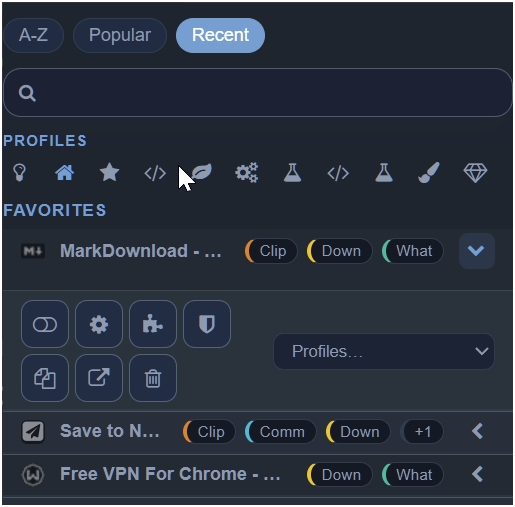
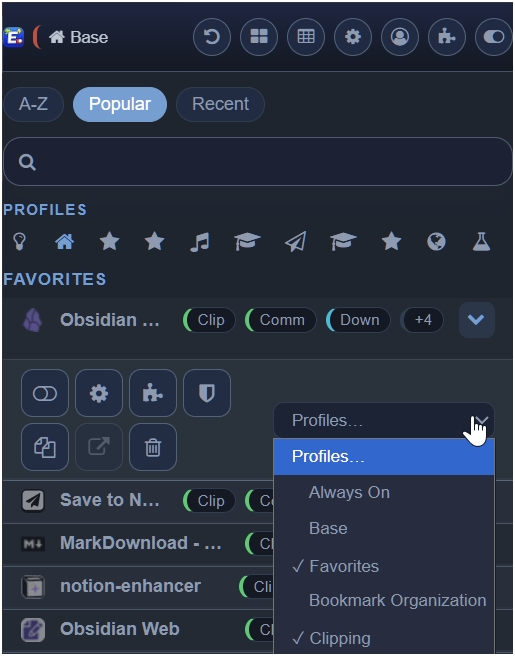
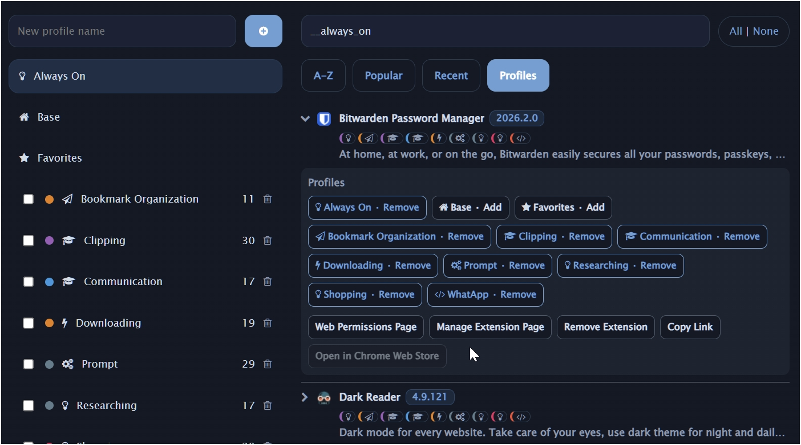
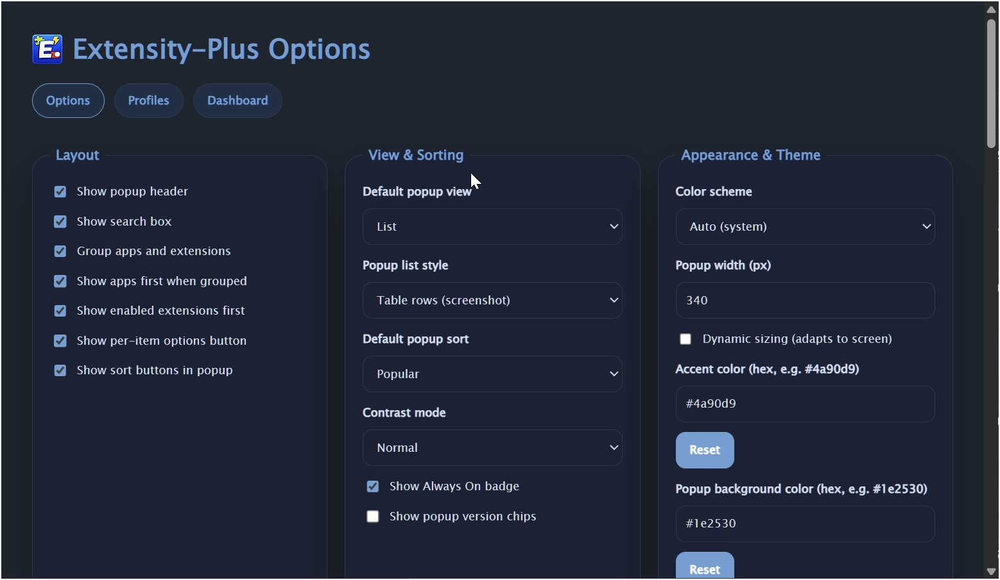
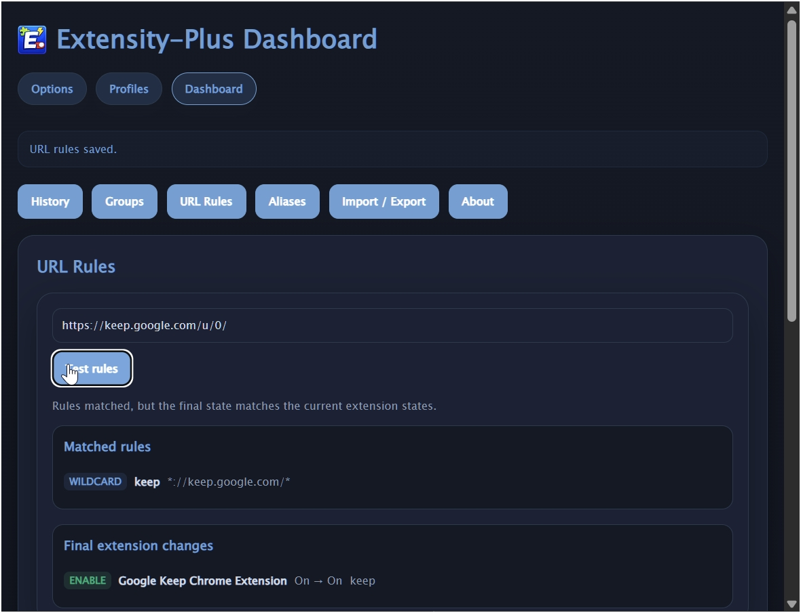

# Extensity-Plus

<p align="center">
  
</p>

Extensity-Plus is a Chrome Manifest V3 extension manager focused on fast popup workflows, reusable profiles, URL rules, and a full management dashboard.

It keeps the original Extensity idea simple, but expands it into a more complete daily-use tool:

- popup-first enable/disable flows
- special profiles like `Always On`, `Base`, and `Favorites`
- searchable, sortable extension lists
- profile-based extension sets
- URL-triggered automation
- dashboard tools for history, aliases, groups, rules, and backup

## Latest Release

Current version: `v4.0.1` (published 2026-04-25)

### What's Changed in v4.0.1

- Fixed popup-to-background active-tab URL handoff so URL rules resolve against the actual page tab instead of popup-window focus context.

Full changelog: https://github.com/Daniel-OS01/Extensity-Plus/compare/v4.0.0...v4.0.1

## What It Looks Like

### Popup: quick actions and profile-aware controls

The popup is built for fast toggling, search, sorting, profile badges, and inline per-extension actions.



### Popup: profile dropdown with special profiles

Profile membership can be edited directly from the popup, including `Always On`, `Base`, `Favorites`, and custom profiles.



### Profiles page

The Profiles page is where you shape named extension sets, review profile membership, and manage reserved profiles alongside custom ones.



### Options page

The Options page controls popup layout, density, sorting defaults, appearance, and behavior-level settings.



### Dashboard and URL rules

The Dashboard brings together history, groups, aliases, import/export, and URL rules with live rule testing.



## Core Features

### Popup controls

- Enable or disable extensions from the popup.
- Toggle all extensions off and restore them with one action.
- Undo the last reversible toggle action.
- Search by extension name, alias, or description.
- Sort by A-Z, recent use, or usage frequency.
- Switch between list and grid views.
- Manage profile membership directly from expanded popup rows.
- Show profile badges, special-profile status, and keyboard-friendly controls.

### Profiles

- Save reusable extension sets as profiles.
- Apply profiles from the popup.
- Keep `Always On`, `Base`, and `Favorites` as special profile layers.
- Rename custom profiles inline.
- Select multiple profiles and bulk delete them.
- Choose the layout used on the Profiles page.
- Cycle profiles with Chrome keyboard shortcuts.

### Dashboard

- Manage aliases for installed extensions.
- Create and edit groups.
- Create, test, and edit URL rules.
- Review extension event history.
- Export inventory as CSV.
- Import and export full backup data.

### Data and automation

- Save lightweight preferences in `chrome.storage.sync`.
- Save larger or device-specific data in `chrome.storage.local`.
- Track history and usage counters.
- Schedule reminder notifications after manual enable flows.
- Apply URL-based enable/disable rules in the background service worker.
- Export and import a versioned backup envelope.

## Architecture

Extensity-Plus uses a background-owned state model:

- `js/background.js` owns extension enable/disable mutations.
- Popup, options, profiles, and dashboard pages communicate through a background message API.
- Undo history, reminders, usage counters, and event history are updated through the same mutation path.
- Larger collections like aliases, groups, rules, and history stay out of sync storage to avoid quota pressure.

Main UI surfaces:

- `index.html`: popup
- `options.html`: options page
- `profiles.html`: profile editor
- `dashboard.html`: management dashboard

Supporting modules:

- `js/storage.js`
- `js/migration.js`
- `js/import-export.js`
- `js/url-rules.js`
- `js/history-logger.js`
- `js/reminders.js`
- `js/drive-sync.js`

## Build and Development

Install dependencies:

```bash
npm install
```

Run tests:

```bash
npm test
```

Validate the manifest:

```bash
npm run check:manifest
```

Build the extension:

```bash
make dist
```

Generate the Chrome Web Store submission bundle:

```bash
npm run bundle:chrome-store
```

Generate the required extension icons from the master PNG source:

```bash
npm run generate:icons
```

Artifacts:

- `dist/dist.zip`
- `artifacts/chrome-web-store/`

GitHub Actions release runs upload a private `release-assets-vX.Y.Z` artifact containing:

- `<package>-extension-vX.Y.Z.zip`
- `<package>-chrome-web-store-upload-vX.Y.Z.zip`
- `submission-metadata.json`
- `checksums.txt`
- `submission-notes.md`

## GitHub Actions

This repository includes `.github/workflows/ci.yml`, which:

- runs tests
- validates the manifest
- builds the extension
- packages release artifacts
- supports manual semver-bump releases and tag-based releases

## Documentation

Additional project documentation lives in `docs/`:

- `docs/extensity-2.0-plan.md`
- `docs/extensity-2.0-status.md`
- `docs/ci-and-release.md`
- `docs/chrome-web-store-checklist.md`

## Credits and Inspiration

The main inspiration for this project is the original [sergiokas/Extensity](https://github.com/sergiokas/Extensity) repo and the broader Extensity open-source lineage.

Additional feature direction and UX ideas were informed by:

- [hankxdev/one-click-extensions-manager](https://github.com/hankxdev/one-click-extensions-manager)
- [JasonGrass/auto-extension-manager](https://github.com/JasonGrass/auto-extension-manager)
- [jeevan-lal/Extensity-Ultra](https://github.com/jeevan-lal/Extensity-Ultra)

## Notes

- This repo is a local evolution of the Extensity concept, not the original upstream release branch.
- Google Drive backup support is still partial because OAuth configuration is not complete.
- If you plan to publish this fork to the Chrome Web Store, review permissions, listing content, privacy disclosures, and OAuth requirements before submission.
